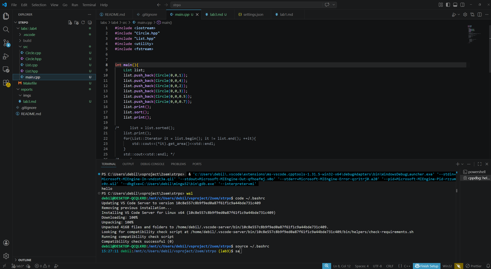
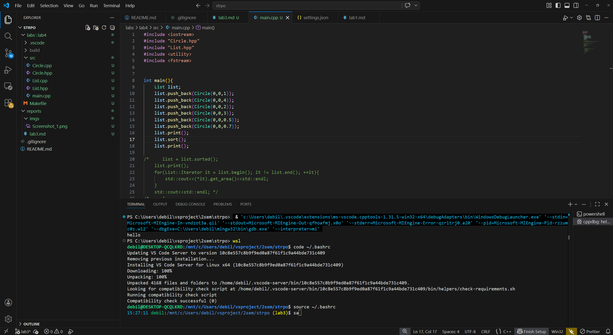
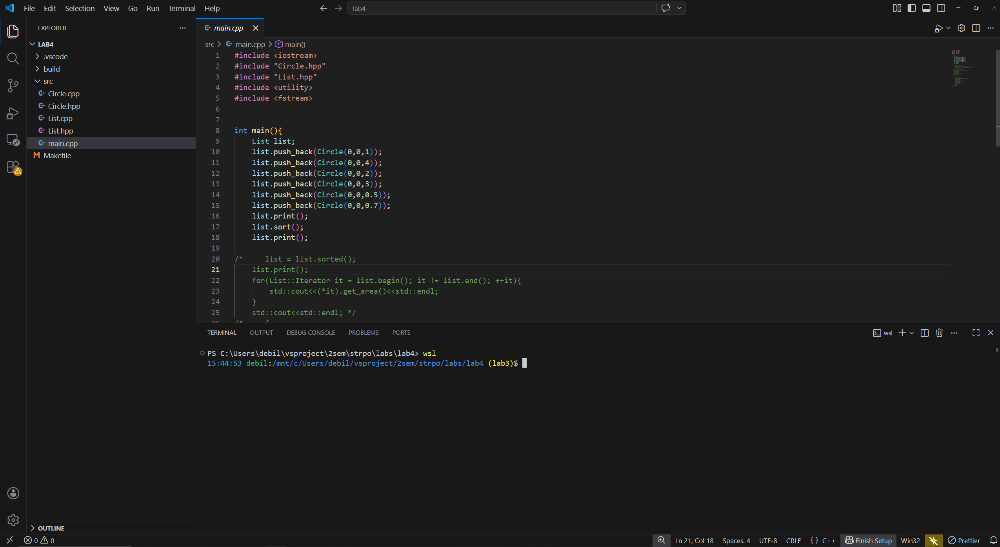
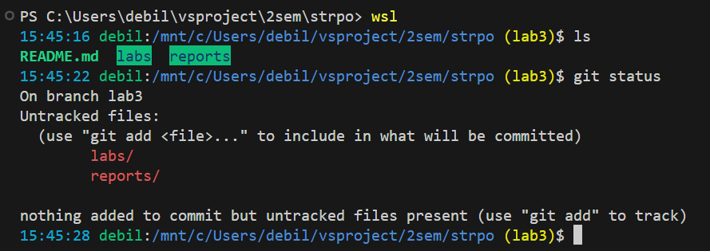
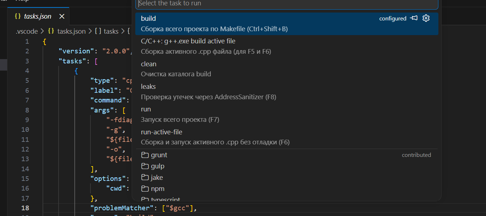
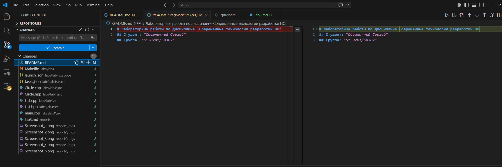

# Лабораторная работа №3. Настройка среды разработки

## Цель работы

Познакомиться с базовыми приёмами настройки инструментов разработки и
настроить рабочее окружение под себя.

## Ход выполнения работы

### 1. Для начала

Программы, которыми я пользуюсь:

- **Редактирование текстовых файлов** — Notepad++ для быстрых правок,
  VS Code для всего остального.
- **Программирование (C++)** — VS Code с расширением `C/C++` и
  `Makefile Tools`, компилятор `g++` из MinGW
  (`C:\Users\debil\mingw32\bin\g++.exe`). В простых задачах собираю
  и запускаю одиночный `.cpp` файл прямо из редактора, в проектах с
  несколькими модулями — через `Makefile`.
- **Выполнение команд в консоли** — Windows Terminal с профилями
  PowerShell и WSL (Ubuntu, оболочка `bash`).
- **Навигация по файловой системе** — встроенный Проводник Windows,
  боковая панель VS Code (Explorer), команды `ls`, `cd` в терминале.
- **Работа с git** — встроенная панель «Source Control» в VS Code,
  а также `git` из командной строки (и в Windows через Git for
  Windows, и в WSL).

#### Альтернативы

Изучил, какие есть варианты замены для каждой из программ.

| Задача | Моя программа | Альтернатива | Чем отличается |
| :--- | :--- | :--- | :--- |
| Редактор | VS Code | Neovim | Работает в терминале, управление только с клавиатуры, настраивается конфигом на Lua, стартует почти мгновенно. |
| IDE для C++ | VS Code | CLion | Глубокий статический анализ, готовая интеграция с CMake, платная (есть студенческая лицензия). |
| Терминал | Windows Terminal | Alacritty / WezTerm | GPU-ускоренный рендер, меньше задержка, но интерфейс настраивается только через конфиг. |
| Оболочка | bash | zsh + Oh My Zsh | Автодополнение по истории, плагины, темы приглашения «из коробки». |
| Файловый менеджер | Проводник | Far Manager, ranger | Двухпанельный интерфейс, работа полностью с клавиатуры. |
| Git-клиент | Source Control в VS Code | LazyGit, GitHub Desktop | LazyGit — текстовый интерфейс прямо в терминале, очень быстрый; GitHub Desktop — простой GUI с минимальным набором действий. |

На несколько дней попробовал **LazyGit** в WSL — понравилось, что
staging/unstaging кусков делается одной клавишей и не нужно
переключаться между вкладками. Для повседневной работы всё же оставил
встроенную панель VS Code, потому что она видна одновременно с
редактором и diff'ом.

**Источники:**
- Документация VS Code: <https://code.visualstudio.com/docs>
- Neovim: <https://neovim.io/>
- JetBrains CLion: <https://www.jetbrains.com/clion/>
- LazyGit: <https://github.com/jesseduffield/lazygit>

---

### 2. Look and Feel

#### Цвета и шрифты

Узнал, что в VS Code тема меняется через командную палитру:
`Ctrl+Shift+P → Preferences: Color Theme` (или `Ctrl+K Ctrl+T`).
Шрифт редактора настраивается через `File → Preferences → Settings`
(параметр `editor.fontFamily`) или напрямую в `settings.json` —
это обычный JSON-файл пользовательских настроек, который открывается
командой `Preferences: Open User Settings (JSON)`.

В качестве изменения установил тему на **Default Dark Modern**.
Шрифт оставил стандартный (Consolas) — он меня устраивает.

Соответствующая строка в `settings.json`:

```json
{
    "workbench.colorTheme": "Default Dark Modern"
}
```




#### Расположение элементов интерфейса

Узнал, что в VS Code расположение панелей меняется через:

- `View → Appearance → Panel Position` — переместить нижнюю панель
  (терминал, вывод, проблемы) вправо, влево или вниз.
- `View → Appearance → Primary Side Bar Position` — перенести Explorer
  слева направо.
- «Customize Layout» (иконка в правом верхнем углу) — общий центр
  настройки видимости всех областей.
- Перетаскиванием вкладок между группами редакторов можно разбить
  рабочую область на несколько колонок.

Попробовал перенести терминал вправо, чтобы код и вывод компилятора
были в одной горизонтали. В итоге вернул обратно вниз: при сборке
длинные строки ошибок `g++` в узкой правой колонке переносятся и
читаются хуже. Explorer слева тоже оставил как был. В итоговой
конфигурации изменений в расположении не делал.



#### Приглашение ко вводу в bash

В консоли я чаще всего пользуюсь WSL (Ubuntu, bash). Узнал, что
приглашение в bash задаётся переменной `PS1` в файле `~/.bashrc`.
В неё можно вставлять специальные последовательности:

- `\u` — имя пользователя,
- `\h` — имя хоста,
- `\w` — полный путь к рабочей директории,
- `\W` — только имя текущей директории,
- `\t` — текущее время в формате HH:MM:SS,
- `\$` — `$` для обычного пользователя и `#` для root,
- `\[\e[XXm\]` — ANSI-коды цветов (32 — зелёный, 34 — синий,
  33 — жёлтый, 36 — голубой, 0 — сброс).

Текущую ветку git можно вытащить командой
`git branch --show-current 2>/dev/null`.

Добавил в конец `~/.bashrc` функцию и свою `PS1`:

```bash
parse_git_branch() {
    git branch --show-current 2>/dev/null | sed 's/.*/ (&)/'
}

PS1='\[\e[36m\]\t\[\e[0m\] \[\e[32m\]\u\[\e[0m\]:\[\e[34m\]\w\[\e[33m\]$(parse_git_branch)\[\e[0m\]\$ '
```

В итоге приглашение показывает:

- текущее время (голубым),
- имя пользователя (зелёным),
- путь к директории (синим),
- ветку git в скобках, если текущий каталог — репозиторий (жёлтым).

Применил изменения через `source ~/.bashrc` — перезапускать терминал
не потребовалось.



**Источники:**
- `man bash`, раздел PROMPTING
- Arch Wiki, Bash/Prompt customization:
  <https://wiki.archlinux.org/title/Bash/Prompt_customization>
- VS Code Themes: <https://code.visualstudio.com/docs/getstarted/themes>

---

### 3. Эргономика работы с кодом

#### Горячие клавиши редактирования

Самые интересные из тех, что выписал:

| Комбинация | Действие |
| :--- | :--- |
| `Ctrl+Enter` | вставить пустую строку ниже и перейти на неё |
| `Ctrl+Shift+Enter` | вставить пустую строку выше |
| `Alt+↑` / `Alt+↓` | переместить строку вверх/вниз |
| `Shift+Alt+↑` / `Shift+Alt+↓` | продублировать строку |
| `Ctrl+Shift+K` | удалить строку целиком |
| `Ctrl+D` | добавить следующее вхождение выделенного в multi-cursor |
| `Alt+Click` | поставить дополнительный курсор |
| `Ctrl+Shift+L` | выделить все вхождения текущего слова |
| `Ctrl+]` / `Ctrl+[` | увеличить/уменьшить отступ выделения |

#### Навигация и рефакторинг

Изучил, как делаются стандартные операции:

- **Поиск по содержанию файлов проекта** — `Ctrl+Shift+F`.
  Есть фильтры по маскам (`*.cpp`, `!**/build/**`) и regex.
- **Перейти к объявлению** — `F12` (или `Ctrl+Click` по символу).
- **Перейти к реализации** — `Ctrl+F12`. Для C++ хорошо работает
  при корректно настроенном расширении `C/C++` и прописанных путях
  к заголовкам в `c_cpp_properties.json`.
- **Найти все использования** — `Shift+F12` (Find All References).
- **Переименовать все вхождения** — `F2`. Работает сразу во всём
  проекте, а не только в файле.
- **Перемещение между важными местами кода:**
  - `Ctrl+P` — быстрый переход к файлу по имени;
  - `Ctrl+Shift+O` — переход к символу в текущем файле;
  - `Ctrl+T` — переход к символу во всём проекте;
  - `Alt+←` / `Alt+→` — назад и вперёд по истории курсора;
  - `Ctrl+Tab` — переключение между недавно открытыми файлами.
- **Комментирование блоков:**
  - `Ctrl+/` — построчный комментарий (`//`);
  - `Shift+Alt+A` — блочный комментарий (`/* ... */`).

Все навигационные возможности для C++ обеспечивает расширение `C/C++`
от Microsoft. Без него Go to Definition работает только по тексту и
часто промахивается на перегруженных функциях.

**Источники:**
- VS Code Keyboard Shortcuts (Windows):
  <https://code.visualstudio.com/shortcuts/keyboard-shortcuts-windows.pdf>
- VS Code C++ Navigation: <https://code.visualstudio.com/docs/cpp/cpp-ide>

---

### 4. Кастомизация процессов

У меня два разных сценария сборки, и я хочу, чтобы на каждый был
свой биндинг:

- **одиночный файл** — быстро проверить какой-нибудь небольшой `.cpp`
  (учебный пример, тест идеи): собрать только этот файл через
  `g++.exe` и сразу запустить;
- **весь проект** — собирать по `Makefile` со всеми зависимостями
  (`Circle.cpp`, `List.cpp`, `main.cpp` → `build/debug.out`).

Именно под эту пару сценариев настроены задачи и клавиши.

#### Свои горячие клавиши

Узнал, что в VS Code свои сочетания настраиваются через
`Ctrl+K Ctrl+S` (GUI) или
`Ctrl+Shift+P → Preferences: Open Keyboard Shortcuts (JSON)`.
К клавишам можно привязывать как встроенные команды, так и запуск
конкретных задач из `tasks.json` через команду
`workbench.action.tasks.runTask` с указанием label задачи в `args`.

#### Tasks: одиночный файл и Makefile

Изначально `.vscode/tasks.json` был сгенерирован самим VS Code при
первой отладке и содержал только задачу сборки активного файла через
`g++.exe`. Я оставил её (для работы с одиночным `.cpp` она идеально
подходит) и добавил рядом задачи для сборки всего проекта через
`mingw32-make.exe` (идёт в комплекте с MinGW). Каждая лабораторная лежит
в отдельной папке (`labs/lab1/`, `labs/lab2/` и т. д.) со своим
`Makefile`, `src/` и `.vscode/`. VS Code открывается на уровне
конкретной работы, поэтому `${workspaceFolder}` автоматически
совпадает с корнем этой лабораторной — пути относительные, переменные
переиспользуются между работами без изменений:

```json
{
    "version": "2.0.0",
    "tasks": [
        {
            "type": "cppbuild",
            "label": "C/C++: g++.exe build active file",
            "command": "C:\\Users\\debil\\mingw32\\bin\\g++.exe",
            "args": [
                "-fdiagnostics-color=always", "-g",
                "${file}", "-o",
                "${fileDirname}\\${fileBasenameNoExtension}.exe"
            ],
            "options": { "cwd": "${fileDirname}" },
            "problemMatcher": ["$gcc"],
            "group": "build"
        },
        {
            "label": "run-active-file",
            "type": "shell",
            "command": "${fileDirname}\\${fileBasenameNoExtension}.exe",
            "options": { "cwd": "${fileDirname}" },
            "dependsOn": "C/C++: g++.exe build active file",
            "problemMatcher": []
        },
        {
            "label": "build",
            "type": "shell",
            "command": "mingw32-make",
            "args": ["build/debug.out"],
            "options": { "cwd": "${workspaceFolder}" },
            "group": { "kind": "build", "isDefault": true },
            "problemMatcher": ["$gcc"]
        },
        {
            "label": "run",
            "type": "shell",
            "command": "mingw32-make",
            "args": ["run"],
            "options": { "cwd": "${workspaceFolder}" },
            "problemMatcher": []
        },
        {
            "label": "leaks",
            "type": "shell",
            "command": "mingw32-make",
            "args": ["leaks"],
            "options": { "cwd": "${workspaceFolder}" },
            "problemMatcher": []
        }
    ]
}
```

- `C/C++: g++.exe build active file` — собрать текущий открытый
  `.cpp` в одноимённый `.exe` рядом с ним.
- `run-active-file` — собрать его же и запустить
  (`dependsOn` тянет сборку перед запуском).
- `build` / `run` / `leaks` — дергают соответствующие цели
  `Makefile` в корне проекта. Цели определены в самом Makefile:
  `run` собирает `build/debug.out` и запускает его, `leaks` — то же
  самое с `-fsanitize=address`.

#### Отладка одного файла по F5

`F5` должен запускать программу в режиме отладки. У меня
это работает именно для одиночного файла — чтобы быстро отлаживать
небольшие примеры. Конфигурация в `launch.json`:

```json
{
    "version": "0.2.0",
    "configurations": [
        {
            "name": "C/C++: g++.exe build and debug active file",
            "type": "cppdbg",
            "request": "launch",
            "program": "${fileDirname}\\${fileBasenameNoExtension}.exe",
            "args": [],
            "stopAtEntry": false,
            "cwd": "${fileDirname}",
            "environment": [],
            "externalConsole": false,
            "MIMode": "gdb",
            "miDebuggerPath": "C:\\Users\\debil\\mingw32\\bin\\gdb.exe",
            "preLaunchTask": "C/C++: g++.exe build active file"
        }
    ]
}
```

При нажатии `F5`:

1. запускается задача `C/C++: g++.exe build active file` —
   компилируется активный `.cpp` с флагом `-g`;
2. VS Code подключает gdb к получившемуся `.exe`;
3. выполнение останавливается на брейкпоинтах, переменные видны
   в боковой панели.

Для отладки всего проекта по Makefile эта конфигурация не
используется — там отдельного биндинга я не делал, в таких случаях
отлаживаю через `gdb` вручную из терминала (цель `debug` в Makefile).

#### Привязка клавиш

В `keybindings.json` добавил:

```json
[
    { "key": "ctrl+shift+b", "command": "workbench.action.tasks.runTask", "args": "build" },
    { "key": "f6",           "command": "workbench.action.tasks.runTask", "args": "run-active-file" },
    { "key": "f7",           "command": "workbench.action.tasks.runTask", "args": "run" },
    { "key": "f8",           "command": "workbench.action.tasks.runTask", "args": "leaks" }
]
```

Итоговый набор:

| Клавиша | Что делает | Что вызывает |
| :--- | :--- | :--- |
| `F5` | Отладка одного файла | компиляция активного `.cpp` с `-g` + gdb |
| `F6` | Запуск одного файла | компиляция активного `.cpp` + запуск `.exe` |
| `Ctrl+Shift+B` | Сборка всего проекта | `mingw32-make build/debug.out` |
| `F7` | Запуск всего проекта | `mingw32-make run` |
| `F8` | Проверка утечек | `mingw32-make leaks` (AddressSanitizer) |

Ключевая идея: `F5`/`F6` — быстрая работа с одним файлом, остальные
три биндинга — работа со всем проектом через Makefile. Так удобно:
когда нужно прогнать учебный пример в одном файле, не нужно трогать
Makefile вообще.

Проверка утечек по `F8` (через `-fsanitize=address`).



**Источники:**
- VS Code Tasks: <https://code.visualstudio.com/docs/editor/tasks>
- VS Code Key Bindings: <https://code.visualstudio.com/docs/getstarted/keybindings>
- VS Code C++ Debugging: <https://code.visualstudio.com/docs/cpp/cpp-debug>
- GNU Make: <https://www.gnu.org/software/make/manual/make.html>

---

### 5. Интеграция с git

У меня `git` установлен и в Windows (Git for Windows, команда `git`
доступна в PowerShell), и в WSL. Для графической работы я использую
встроенную панель **Source Control** в VS Code (`Ctrl+Shift+G`) —
она распознаёт репозиторий автоматически и показывает изменения,
индекс, коммиты и синхронизацию с удалённым репозиторием.

Дополнительно в `settings.json` у меня включён `git.autofetch` — раз
в несколько минут VS Code сам подтягивает информацию об удалённых
ветках, чтобы индикатор отставания был актуальным.

#### Просмотр изменений

- В панели Source Control клик по изменённому файлу открывает
  side-by-side diff между рабочей копией и индексом (или `HEAD`).
- В терминале: `git status`, `git diff`, `git diff --staged`.

#### Добавление файлов в индекс

- В панели Source Control — кнопка `+` напротив файла (Stage Changes)
  или «Stage All Changes» для всей группы.
- Для части изменений: выделить нужные строки в diff → правый клик →
  `Stage Selected Ranges`. Это аналог `git add -p`.
- В терминале: `git add <file>` или `git add -p`.

#### Коммиты

- В поле сверху панели Source Control ввести сообщение → `Ctrl+Enter`
  (или кнопка галочки).
- В терминале: `git commit -m "message"`.

Если ничего не заиндексировано, VS Code спросит, коммитить ли все
изменения сразу.

#### Добавление удалённого репозитория

- Для нового локального репозитория: `... → Remote → Add Remote...` →
  ввести URL и имя remote.
- В терминале: `git remote add origin <url>`.
- Кнопка `Publish Branch` публикует локальную ветку в remote.

#### Получение обновлений

- Меню `...` в Source Control → `Pull` или `Fetch`.
- Кнопка «Synchronize Changes» внизу — делает `git pull` и затем
  `git push`.
- В терминале: `git fetch` + `git pull`.

#### Отправка обновлений

- Меню `...` → `Push`.
- Кнопка «Synchronize Changes».
- В терминале: `git push` (при первом пуше новой ветки —
  `git push -u origin <branch>`).

#### Разрешение конфликтов

При конфликте файлы с меткой `!` появляются в группе «Merge Changes».
VS Code показывает над каждым блоком кнопки:

- `Accept Current Change` — оставить свою версию;
- `Accept Incoming Change` — взять версию из пришедшей ветки;
- `Accept Both Changes` — соединить обе;
- `Compare Changes` — открыть трёхпанельный merge editor с базой,
  «нашей» и «их» версией.

После ручного разрешения файл нужно заиндексировать (`Stage Changes`)
и сделать коммит слияния — VS Code сам подставит стандартное
сообщение.



**Источники:**
- VS Code Source Control:
  <https://code.visualstudio.com/docs/sourcecontrol/overview>
- Git Book: <https://git-scm.com/book/en/v2>

---