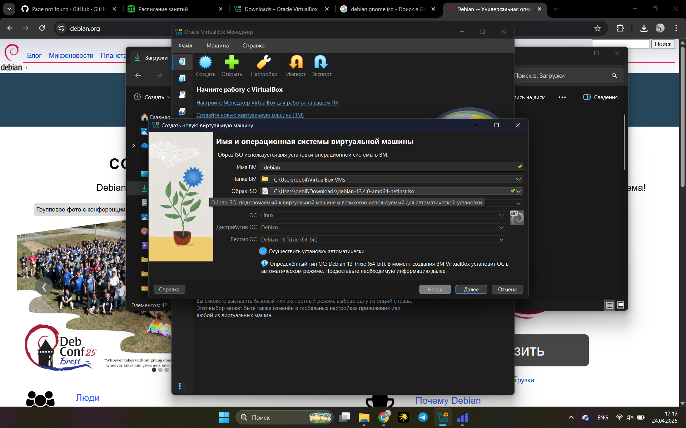
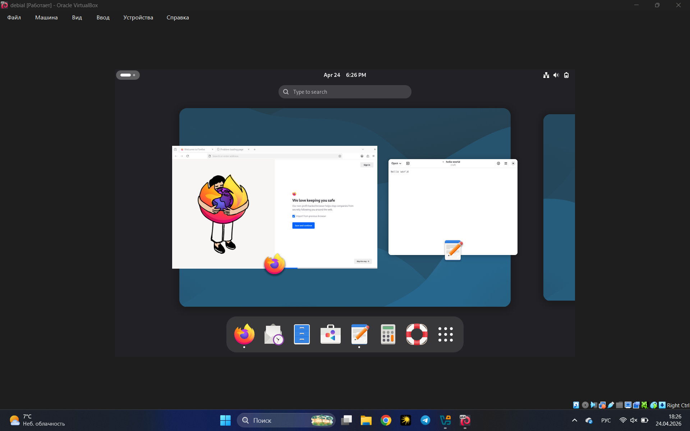
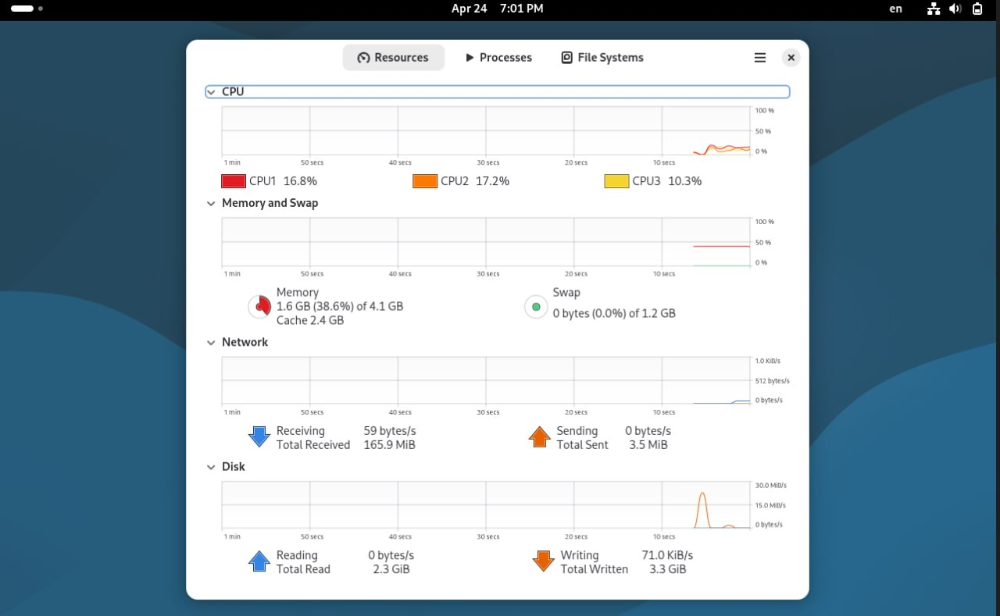
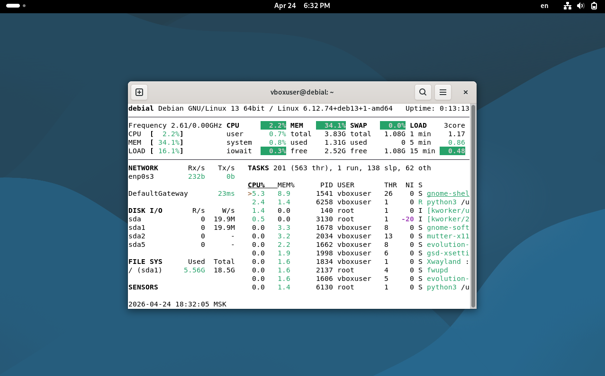
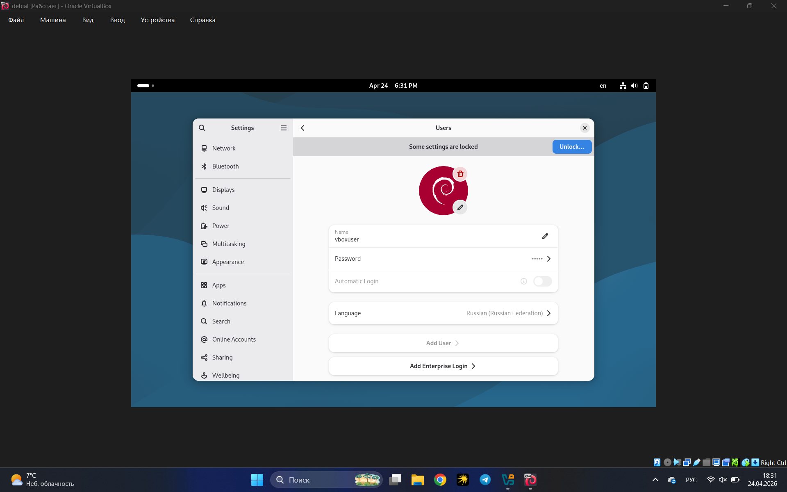
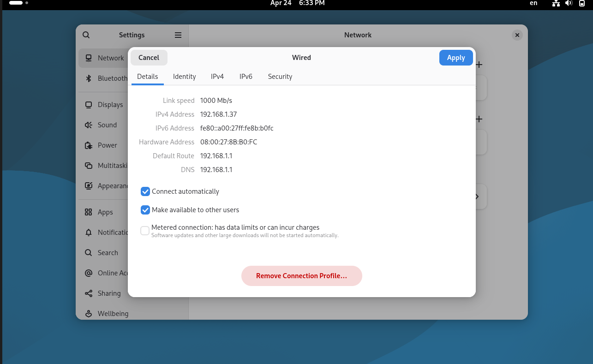
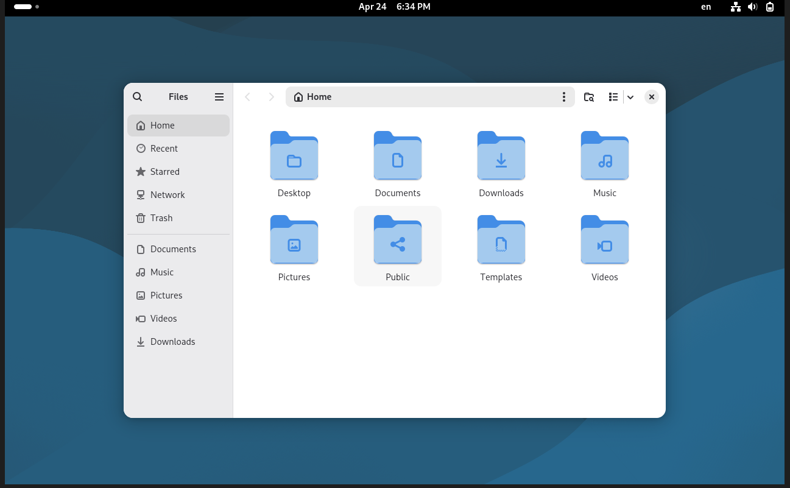
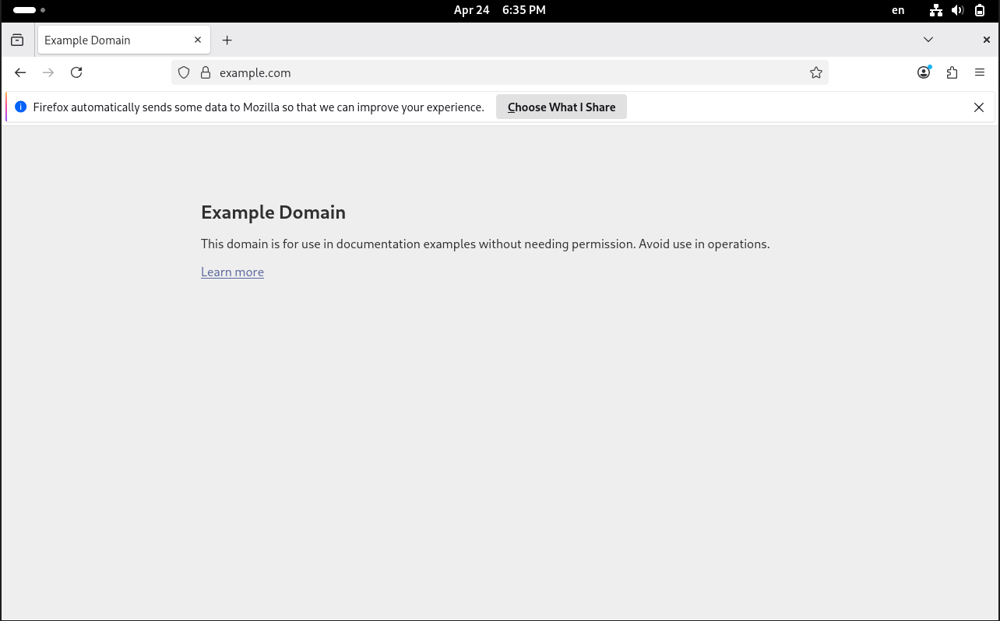
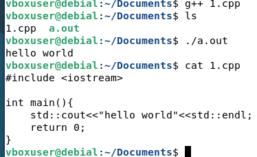

# Лабораторная работа №4. Знакомство с Linux

## 1. Выбор варианта

Вариант выбирается по первому символу MD5-хеша ФИО:

```console
$ echo "Светличный Сергей Александрович" | md5sum 
64432d3fefb596ce36b8dbcc77821d01  -
```

Первый символ хеша — `6`. В соответствии с таблицей вариантов был выбран:
**Debian + GNOME** (Код 6).

## 2. Изучение особенностей дистрибутива

* **Разработчик:** Разработкой и поддержкой занимается независимое сообщество разработчиков *Debian Project*. 
* **Базовый дистрибутив:** Debian является независимым базовым дистрибутивом. На его пакетной базе построены многие популярные системы, такие как Ubuntu, Linux Mint и Kali Linux.
* **Релизы:** Стабильные версии выпускаются примерно раз в 2 года. В данной работе используется актуальная версия **Debian 13 (Trixie)**.
* **Источники информации:** Официальная документация ([Debian Wiki](https://wiki.debian.org/)), форумы сообщества и универсальный справочник Arch Wiki.

### Пакетный менеджер
Debian использует систему управления пакетами **APT** (Advanced Package Tool). Основные операции:
* **Поиск:** `apt search <название>`
* **Установка:** `sudo apt install <название>`
* **Обновление списков:** `sudo apt update`
* **Обновление системы:** `sudo apt upgrade`
* **Удаление:** `sudo apt remove <название>`

### Системные требования
Для работы Debian 13 с графическим окружением **GNOME** рекомендуются следующие характеристики:
* **Процессор:** 1.0 GHz и выше (рекомендуется 2 ядра).
* **ОЗУ:** Минимум 2 GB (рекомендуется 4 GB для плавной работы интерфейса).
* **Диск:** Минимум 10 GB (рекомендуется 20-30 GB для установки дополнительного ПО).

## 3. Установка ОС

Работа проводилась в среде виртуализации **Oracle VM VirtualBox**. Для установки использовался образ сетевого установщика (`debian-13.4.0-amd64-netinst.iso`).



## 4. Настройка и установка пакетов

### Управление окнами
Окружение GNOME поддерживает эффективную многозадачность. Переключение между окнами осуществляется через режим «Обзор» (кнопка Activities или клавиша Super).



### Отслеживание системных ресурсов
В системе предустановлен графический «Системный монитор». 



Дополнительно для демонстрации работы пакетного менеджера был установлен консольный инструмент **glances**:
```bash
sudo apt install glances
```


### Управление пользователями
Изменение пароля и параметров учетной записи (включая аватар и права доступа) производится в меню `Настройки -> Пользователи`. Блокировка экрана выполняется сочетанием `Super + L`.



### Сетевые подключения
Управление сетевыми интерфейсами осуществляется через системный трей в правом верхнем углу или в разделе настроек «Сеть».



### Работа с файлами
В качестве стандартного файлового менеджера используется **Nautilus (Files)**, предоставляющий доступ к домашней директории, внешним носителям и сетевым ресурсам.



### Выход в интернет
Для веб-серфинга в дистрибутив включен браузер **Firefox ESR** (Extended Support Release).



### Инструменты для разработки
Для подготовки среды разработки был установлен мета-пакет компиляторов:
```bash
sudo apt install build-essential
```

