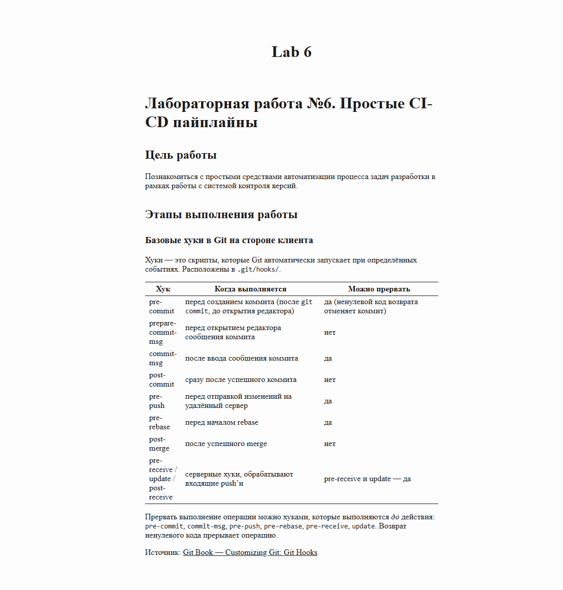
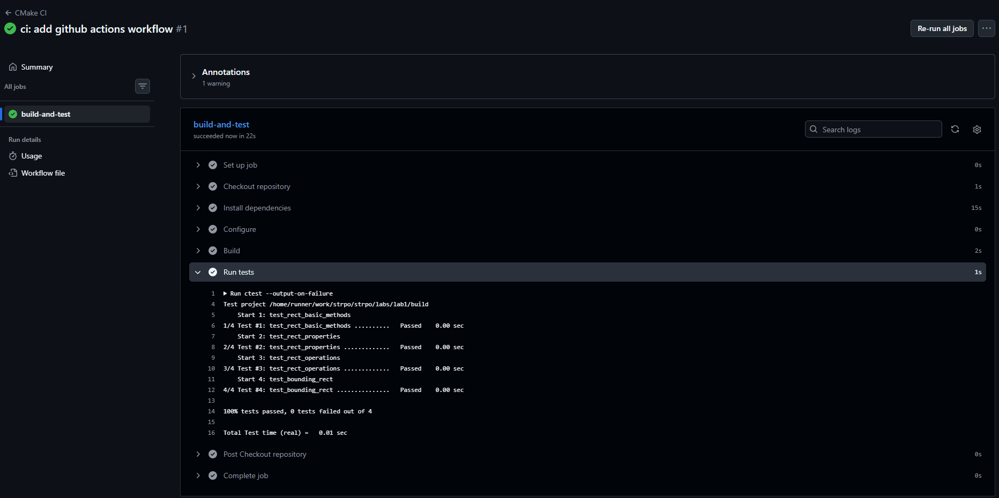

# Лабораторная работа №6. Простые CI-CD пайплайны

## Цель работы

Познакомиться с простыми средствами автоматизации процесса задач разработки в
рамках работы с системой контроля версий.

## Этапы выполнения работы

### Базовые хуки в Git на стороне клиента

Хуки - это скрипты, которые Git автоматически запускает при определённых
событиях. Расположены в `.git/hooks/`.

| Хук | Когда выполняется | Можно прервать |
|-----|-------------------|----------------|
| pre-commit | перед созданием коммита (после `git commit`, до открытия редактора) | да (ненулевой код возврата отменяет коммит) |
| prepare-commit-msg | перед открытием редактора сообщения коммита | нет |
| commit-msg | после ввода сообщения коммита | да |
| post-commit | сразу после успешного коммита | нет |
| pre-push | перед отправкой изменений на удалённый сервер | да |
| pre-rebase | перед началом rebase | да |
| post-merge | после успешного merge | нет |
| pre-receive / update / post-receive | серверные хуки, обрабатывают входящие push'и | pre-receive и update - да |

Прервать выполнение операции можно хуками, которые выполняются *до* действия:
`pre-commit`, `commit-msg`, `pre-push`, `pre-rebase`, `pre-receive`, `update`.
Возврат ненулевого кода прерывает операцию.

Источник: [Git Book - Customizing Git: Git Hooks](https://git-scm.com/book/ru/v2/%D0%9D%D0%B0%D1%81%D1%82%D1%80%D0%BE%D0%B9%D0%BA%D0%B0-Git-%D0%A5%D1%83%D0%BA%D0%B8-%D0%B2-Git)

#### Хук pre-commit: проверка на запрещённый контент

Создал файл `.git/hooks/pre-commit` и сделал его исполняемым:

```bash
cd .git/hooks
touch pre-commit
chmod +x pre-commit
```

Содержимое хука - проверка staged-файлов на ssh-ключи, AWS-токены, `BEGIN
PRIVATE KEY` и т.п.:

```bash
#!/bin/bash

echo "Checking for forbidden patterns..."

forbidden_patterns="BEGIN [A-Z]+ PRIVATE KEY|ssh-rsa AAAA|AKIA[0-9A-Z]{16}|password\s*=\s*['\"][^'\"]+['\"]"

files=$(git diff --cached --name-only --diff-filter=ACM)

for file in $files; do
    if [ -f "$file" ] && grep -E "$forbidden_patterns" "$file" > /dev/null; then
        echo "ERROR: Forbidden content detected in $file"
        exit 1
    fi
done

echo "Check passed"
exit 0
```

#### Хук commit-msg: проверка сообщения коммита

Файл `.git/hooks/commit-msg` - требует длину сообщения не меньше 10 символов:

```bash
#!/bin/bash

commit_msg_file=$1
commit_msg=$(cat "$commit_msg_file")

if [[ ${#commit_msg} -lt 10 ]]; then
    echo "Commit message too short (need at least 10 chars)!"
    exit 1
fi

exit 0
```

#### Демонстрация работы хуков

Попытка коммита с коротким сообщением:

```
$ echo "hello" >> demo.txt
$ git add demo.txt
$ git commit -m "fix"
Checking for forbidden patterns...
Check passed
Commit message too short (need at least 10 chars)!
```

Попытка закоммитить файл с подозрительным содержимым (для теста добавил в
файл строку `ssh-rsa AAAAB3Nza...`):

```
$ echo "ssh-rsa AAAAB3Nza..." > demo.txt
$ git add demo.txt
$ git commit -m "add config file"
Checking for forbidden patterns...
ERROR: Forbidden content detected in demo.txt
```

Нормальный коммит проходит:

```
$ echo "ok" > demo.txt
$ git add demo.txt
$ git commit -m "lab6: add client-side hooks"
Checking for forbidden patterns...
Check passed
[lab6 943e4a2] lab6: add client-side hooks
 1 file changed, 1 insertion(+)
 create mode 100644 demo.txt
```

### Хуки Git на стороне сервера

#### Создание копии репозитория и push в неё

Создал bare-копию репозитория рядом с основным:

```
$ cd ..
$ git clone --bare ./strpo ./server.git
Cloning into bare repository './server.git'...
done.
```

> **Примечание:** для серверных хуков нужен именно bare-репозиторий
> (`--bare`) - в обычный нельзя пушить в текущую ветку.

В основном репозитории добавил копию как удалённый репозиторий:

```
$ git remote add server ../server.git
$ git remote -v
origin  git@github.com:dryslo/strpo.git (fetch)
origin  git@github.com:dryslo/strpo.git (push)
server  ../server.git (fetch)
server  ../server.git (push)
```

Push прошёл успешно:

```
$ git push server lab6
Everything up-to-date
```

#### Конвертация Markdown → HTML

Для конвертации использовал утилиту **pandoc** - универсальный конвертер
документов, поддерживает множество форматов (md, html, docx, pdf, latex).
Базовый вызов: `pandoc -f markdown -t html -o out.html in.md`.

Установка в WSL: `sudo apt install pandoc`.

Источники: [официальный сайт pandoc](https://pandoc.org/), [man pandoc](https://pandoc.org/MANUAL.html).

#### Серверный хук post-receive

В bare-репозитории `server.git/hooks/post-receive` создал хук:

```bash
#!/bin/bash
while read oldrev newrev refname; do
    if [[ $refname == "refs/heads/lab6" ]]; then
        echo "Push detected in lab6 branch. Building HTML report..."

        REPORT_FILE="reports/lab6.md"
        OUTPUT_DIR="$(realpath -m ../strpo/html)"
        OUTPUT_HTML="$OUTPUT_DIR/lab6.html"

        mkdir -p "$OUTPUT_DIR"

        git --git-dir="$PWD" show "$newrev:$REPORT_FILE" \
            | pandoc -f markdown -t html --embed-resources --standalone \
              --metadata title="Lab 6" -o "$OUTPUT_HTML"

        if [ $? -eq 0 ]; then
            echo "HTML report generated: $OUTPUT_HTML"
        else
            echo "Error: failed to generate HTML report"
            exit 1
        fi
    fi
done
```

Сделал исполняемым: `chmod +x server.git/hooks/post-receive`.

Вывод при push'е изменений в ветку `lab6`:

```
$ git push server lab6
Enumerating objects: 5, done.
Counting objects: 100% (5/5), done.
Delta compression using up to 12 threads
Compressing objects: 100% (3/3), done.
Writing objects: 100% (4/4), 1.27 KiB | 72.00 KiB/s, done.
Total 4 (delta 1), reused 0 (delta 0), pack-reused 0
remote: Push detected in lab6 branch. Building HTML report...
remote: HTML report generated: /mnt/c/Users/debil/vsproject/2sem/strpo/html/lab6.html
To ../server.git
   943e4a2..db136e8  lab6 -> lab6
```

HTML-файл успешно отображается в браузере и обновляется при каждом push'е.



### Сборка с помощью CMake

Установка CMake в WSL (Ubuntu): `sudo apt install cmake`.

```
$ cmake --version
cmake version 3.28.3
```

#### Основные понятия CMake

* **Проект (project)** - логическая единица верхнего уровня. Задаётся командой
  `project(<имя> [LANGUAGES CXX])`.
* **Цель (target)** - единица сборки: исполняемый файл, библиотека или
  пользовательская команда.
* **Исполняемый файл** - `add_executable(<имя> <sources>)`.
* **Библиотека** - `add_library(<имя> [STATIC|SHARED] <sources>)`. По
  умолчанию статическая.

Основные конструкции:

| Команда | Назначение |
|---------|------------|
| `cmake_minimum_required(VERSION x.y)` | минимальная требуемая версия CMake |
| `project(name LANGUAGES CXX)` | объявление проекта |
| `add_library(lib_name src1.cpp src2.cpp)` | библиотека из исходников |
| `add_executable(exe_name main.cpp)` | исполняемый файл |
| `target_link_libraries(target PRIVATE lib)` | линковка цели с библиотекой |
| `target_include_directories(target PUBLIC dir)` | каталог заголовков для цели |
| `set(CMAKE_CXX_STANDARD 17)` | стандарт C++ |
| `add_subdirectory(dir)` | подключить дочерний `CMakeLists.txt` |
| `enable_testing()` / `add_test(NAME ... COMMAND ...)` | регистрация тестов CTest |

Спецификаторы видимости (`PUBLIC` / `PRIVATE` / `INTERFACE`) определяют, кому
передаются настройки:
* `PRIVATE` - только самой цели;
* `INTERFACE` - только потребителям;
* `PUBLIC` - и цели, и потребителям.

Источники: [официальная документация CMake](https://cmake.org/cmake/help/latest/), [статья на Хабре](https://habr.com/ru/articles/904992/).

#### Переписывание сборки lab1 на CMake

В качестве работы по «Структурам данных» взял **lab1**: классы `Rect`,
`MyString`, `Barrel`, `Matrix`, `TextWrapper` в `src/`, основной файл
`lab1.cpp`, четыре теста на `Rect` в `tests/`.

Корневой `labs/lab1/CMakeLists.txt`:

```cmake
cmake_minimum_required(VERSION 3.16)
project(lab1 LANGUAGES CXX)

set(CMAKE_CXX_STANDARD 17)
set(CMAKE_CXX_STANDARD_REQUIRED ON)

# Библиотека со всей функциональностью (классы)
add_library(lab1_library
    src/rect.cpp
    src/my_string.cpp
    src/barrel.cpp
    src/matrix.cpp
    src/text_wrapper.cpp
)
target_include_directories(lab1_library PUBLIC src)

# Основной исполняемый файл
add_executable(lab1 src/lab1.cpp)
target_link_libraries(lab1 PRIVATE lab1_library)

# Тесты
enable_testing()
add_subdirectory(tests)
```

`labs/lab1/tests/CMakeLists.txt`:

```cmake
set(TESTS
    test_rect_basic_methods
    test_rect_properties
    test_rect_operations
    test_bounding_rect
)

foreach(test_name ${TESTS})
    add_executable(${test_name} ${test_name}.cpp)
    target_link_libraries(${test_name} PRIVATE lab1_library)
    add_test(NAME ${test_name} COMMAND ${test_name})
endforeach()
```

#### Сборка и запуск

Конфигурация:

```
$ cd labs/lab1
$ mkdir -p build && cd build
$ cmake ..
-- The CXX compiler identification is GNU 13.3.0
-- Detecting CXX compiler ABI info
-- Detecting CXX compiler ABI info - done
-- Check for working CXX compiler: /usr/bin/c++ - skipped
-- Detecting CXX compile features
-- Detecting CXX compile features - done
-- Configuring done (2.3s)
-- Generating done (0.4s)
-- Build files have been written to: /mnt/c/Users/debil/vsproject/2sem/strpo/labs/lab1/build
```

Сборка:

```
$ make
[  6%] Building CXX object CMakeFiles/lab1_library.dir/src/rect.cpp.o
[ 12%] Building CXX object CMakeFiles/lab1_library.dir/src/my_string.cpp.o
[ 18%] Building CXX object CMakeFiles/lab1_library.dir/src/barrel.cpp.o
[ 25%] Building CXX object CMakeFiles/lab1_library.dir/src/matrix.cpp.o
[ 31%] Building CXX object CMakeFiles/lab1_library.dir/src/text_wrapper.cpp.o
[ 37%] Linking CXX static library liblab1_library.a
[ 37%] Built target lab1_library
[ 43%] Building CXX object CMakeFiles/lab1.dir/src/lab1.cpp.o
[ 50%] Linking CXX executable lab1
[ 50%] Built target lab1
[ 56%] Building CXX object tests/CMakeFiles/test_rect_basic_methods.dir/test_rect_basic_methods.cpp.o
[ 62%] Linking CXX executable test_rect_basic_methods
[ 62%] Built target test_rect_basic_methods
[ 68%] Building CXX object tests/CMakeFiles/test_rect_properties.dir/test_rect_properties.cpp.o
[ 75%] Linking CXX executable test_rect_properties
[ 75%] Built target test_rect_properties
[ 81%] Building CXX object tests/CMakeFiles/test_rect_operations.dir/test_rect_operations.cpp.o
[ 87%] Linking CXX executable test_rect_operations
[ 87%] Built target test_rect_operations
[ 93%] Building CXX object tests/CMakeFiles/test_bounding_rect.dir/test_bounding_rect.cpp.o
[100%] Linking CXX executable test_bounding_rect
[100%] Built target test_bounding_rect
```

Запуск основного исполняемого файла:

```
$ ./lab1
Default: 0x7ffec1ec3a20
destructor 0x7ffec1ec3a20
Params: 0x7ffec1ec3a20
destructor 0x7ffec1ec3a20
Params: 0x7ffec1ec39f0
Copy: 0x7ffec1ec3a00
Copy: 0x7ffec1ec3a20
destructor 0x7ffec1ec3a20
destructor 0x7ffec1ec3a00
destructor 0x7ffec1ec39f0
Default: 0x7ffec1ec39e0
Params: 0x646a506a56c0
Copy: 0x7ffec1ec39f0
Default: 0x7ffec1ec3a50
...
```

Запуск тестов через CTest:

```
$ ctest
Test project /mnt/c/Users/debil/vsproject/2sem/strpo/labs/lab1/build
    Start 1: test_rect_basic_methods
1/4 Test #1: test_rect_basic_methods ..........   Passed    0.01 sec
    Start 2: test_rect_properties
2/4 Test #2: test_rect_properties .............   Passed    0.01 sec
    Start 3: test_rect_operations
3/4 Test #3: test_rect_operations .............   Passed    0.01 sec
    Start 4: test_bounding_rect
4/4 Test #4: test_bounding_rect ...............   Passed    0.01 sec

100% tests passed, 0 tests failed out of 4

Total Test time (real) =   0.07 sec
```

### Автоматизация задач CMake в git

Создал ветку `dev`:

```
$ git checkout -b dev
Switched to a new branch 'dev'
```

#### Хук pre-commit: запуск тестов

К существующему `.git/hooks/pre-commit` добавил блок, который при коммите в
`dev` собирает проект и прогоняет тесты. Если тесты падают - коммит
отменяется.

```bash
branch=$(git rev-parse --abbrev-ref HEAD)

if [ "$branch" = "dev" ]; then
    echo "Running CMake tests..."

    repo_root=$(git rev-parse --show-toplevel)
    cd "$repo_root/labs/lab1" || exit 1

    mkdir -p build && cd build || exit 1
    cmake .. > /dev/null
    make > /dev/null || { echo "Build failed. Commit aborted."; exit 1; }
    ctest --output-on-failure || { echo "Tests failed. Commit aborted."; exit 1; }

    echo "All tests passed"
fi
```

Вывод при коммите в `dev`:

```
$ git commit -m "test commit in dev"
Checking for forbidden patterns...
Check passed
Running CMake tests...
Test project /mnt/c/Users/debil/vsproject/2sem/strpo/labs/lab1/build
    Start 1: test_rect_basic_methods
1/4 Test #1: test_rect_basic_methods ..........   Passed    0.01 sec
    Start 2: test_rect_properties
2/4 Test #2: test_rect_properties .............   Passed    0.01 sec
    Start 3: test_rect_operations
3/4 Test #3: test_rect_operations .............   Passed    0.01 sec
    Start 4: test_bounding_rect
4/4 Test #4: test_bounding_rect ...............   Passed    0.01 sec

100% tests passed, 0 tests failed out of 4

Total Test time (real) =   0.07 sec
All tests passed
[dev 846cf8f] test commit in dev
 1 file changed, 1 insertion(+)
```

Проверка на падающем тесте: специально сломал ассерт в
`tests/test_rect_basic_methods.cpp`, попытался закоммитить - коммит должен
отмениться:

```
$ git commit -m "commit with broken test"
Checking for forbidden patterns...
Check passed
Running CMake tests...
make[1]: Warning: File 'CMakeFiles/Makefile2' has modification time 0.053 s in the future
make[2]: Warning: File 'CMakeFiles/lab1_library.dir/compiler_depend.make' has modification time 0.024 s in the future
make[2]: warning:  Clock skew detected.  Your build may be incomplete.
make[2]: Warning: File 'CMakeFiles/lab1.dir/compiler_depend.make' has modification time 0.077 s in the future
make[2]: warning:  Clock skew detected.  Your build may be incomplete.
make[2]: Warning: File 'tests/CMakeFiles/test_rect_basic_methods.dir/compiler_depend.make' has modification time 0.061 s in the future
make[2]: warning:  Clock skew detected.  Your build may be incomplete.
make[2]: Warning: File 'tests/CMakeFiles/test_rect_properties.dir/compiler_depend.make' has modification time 0.042 s in the future
make[2]: warning:  Clock skew detected.  Your build may be incomplete.
make[2]: Warning: File 'tests/CMakeFiles/test_rect_operations.dir/compiler_depend.make' has modification time 0.036 s in the future
make[2]: warning:  Clock skew detected.  Your build may be incomplete.
make[2]: Warning: File 'tests/CMakeFiles/test_bounding_rect.dir/compiler_depend.make' has modification time 0.034 s in the future
make[2]: warning:  Clock skew detected.  Your build may be incomplete.
make[1]: warning:  Clock skew detected.  Your build may be incomplete.
Test project /mnt/c/Users/debil/vsproject/2sem/strpo/labs/lab1/build
    Start 1: test_rect_basic_methods
1/4 Test #1: test_rect_basic_methods ..........Subprocess aborted***Exception:   0.03 sec
test_rect_basic_methods: /mnt/c/Users/debil/vsproject/2sem/strpo/labs/lab1/tests/test_rect_basic_methods.cpp:6: int main(): Assertion `r_default.get_left() == 999' failed.

    Start 2: test_rect_properties
2/4 Test #2: test_rect_properties .............   Passed    0.01 sec
    Start 3: test_rect_operations
3/4 Test #3: test_rect_operations .............   Passed    0.01 sec
    Start 4: test_bounding_rect
4/4 Test #4: test_bounding_rect ...............   Passed    0.01 sec

75% tests passed, 1 tests failed out of 4

Total Test time (real) =   0.11 sec

The following tests FAILED:
          1 - test_rect_basic_methods (Subprocess aborted)
Errors while running CTest
Tests failed. Commit aborted.
```

Проверка для `merge`. **Особенность Git**: при `git merge` без конфликтов
merge-коммит создаётся автоматически и хук `pre-commit` не вызывается -
для этого случая Git предусматривает отдельный хук `pre-merge-commit`.
Создал его с тем же блоком прогона тестов, что и в `pre-commit`:

```bash
#!/bin/bash
branch=$(git rev-parse --abbrev-ref HEAD)

if [ "$branch" = "dev" ]; then
    echo "Running CMake tests on merge..."

    repo_root=$(git rev-parse --show-toplevel)
    cd "$repo_root/labs/lab1" || exit 1

    mkdir -p build && cd build || exit 1
    cmake .. > /dev/null
    make > /dev/null || { echo "Build failed. Merge aborted."; exit 1; }
    ctest --output-on-failure || { echo "Tests failed. Merge aborted."; exit 1; }

    echo "All tests passed"
fi

exit 0
```

Воспроизведение сценария:

```
$ git checkout -b feature
$ echo "// feature change" >> labs/lab1/src/lab1.cpp
$ git add labs && git commit -m "feature change in branch"
$ git checkout dev
$ git merge --no-ff feature -m "merge feature into dev"
Running CMake tests on merge...
make[1]: Warning: File 'CMakeFiles/Makefile2' has modification time 0.034 s in the future
make[2]: Warning: File 'CMakeFiles/lab1_library.dir/compiler_depend.make' has modification time 0.0084 s in the future
make[2]: warning:  Clock skew detected.  Your build may be incomplete.
make[2]: Warning: File 'CMakeFiles/lab1.dir/compiler_depend.make' has modification time 0.057 s in the future
make[2]: warning:  Clock skew detected.  Your build may be incomplete.
make[2]: Warning: File 'tests/CMakeFiles/test_rect_basic_methods.dir/compiler_depend.make' has modification time 0.025 s in the future
make[2]: warning:  Clock skew detected.  Your build may be incomplete.
make[2]: Warning: File 'tests/CMakeFiles/test_rect_properties.dir/compiler_depend.make' has modification time 0.02 s in the future
make[2]: warning:  Clock skew detected.  Your build may be incomplete.
make[2]: Warning: File 'tests/CMakeFiles/test_rect_operations.dir/compiler_depend.make' has modification time 0.012 s in the future
make[2]: warning:  Clock skew detected.  Your build may be incomplete.
make[1]: warning:  Clock skew detected.  Your build may be incomplete.
Test project /mnt/c/Users/debil/vsproject/2sem/strpo/labs/lab1/build
    Start 1: test_rect_basic_methods
1/4 Test #1: test_rect_basic_methods ..........   Passed    0.01 sec
    Start 2: test_rect_properties
2/4 Test #2: test_rect_properties .............   Passed    0.01 sec
    Start 3: test_rect_operations
3/4 Test #3: test_rect_operations .............   Passed    0.01 sec
    Start 4: test_bounding_rect
4/4 Test #4: test_bounding_rect ...............   Passed    0.01 sec

100% tests passed, 0 tests failed out of 4

Total Test time (real) =   0.07 sec
All tests passed
Merge made by the 'ort' strategy.
 labs/lab1/src/lab1.cpp | 1 +
 1 file changed, 1 insertion(+)
```

Хук `pre-merge-commit` отработал автоматически: собрал проект, прогнал
тесты и пропустил merge.

#### Хук post-commit: сборка библиотеки

Файл `.git/hooks/post-commit`:

```bash
#!/bin/bash

branch=$(git rev-parse --abbrev-ref HEAD)

if [ "$branch" = "dev" ]; then
    echo "Building library..."

    repo_root=$(git rev-parse --show-toplevel)
    cd "$repo_root/labs/lab1" || exit 1

    mkdir -p build && cd build || exit 1
    cmake .. > /dev/null
    make lab1_library

    echo "Library build finished"
fi
```

Вывод:

```
$ git commit -m "commit for check post-commit hook"
Checking for forbidden patterns...
Check passed
Running CMake tests...
make: Warning: File 'Makefile' has modification time 0.0096 s in the future
make[1]: Warning: File 'CMakeFiles/Makefile2' has modification time 0.39 s in the future
make[2]: Warning: File 'CMakeFiles/lab1_library.dir/progress.make' has modification time 0.3 s in the future
make[2]: warning:  Clock skew detected.  Your build may be incomplete.
make[2]: Warning: File 'CMakeFiles/lab1_library.dir/progress.make' has modification time 0.049 s in the future
make[2]: warning:  Clock skew detected.  Your build may be incomplete.
make[2]: Warning: File 'CMakeFiles/lab1.dir/compiler_depend.make' has modification time 0.42 s in the future
make[2]: warning:  Clock skew detected.  Your build may be incomplete.
make[2]: Warning: File 'tests/CMakeFiles/test_rect_basic_methods.dir/compiler_depend.make' has modification time 0.39 s in the future
make[2]: warning:  Clock skew detected.  Your build may be incomplete.
make[2]: Warning: File 'tests/CMakeFiles/test_rect_properties.dir/compiler_depend.make' has modification time 0.38 s in the future
make[2]: warning:  Clock skew detected.  Your build may be incomplete.
make[2]: Warning: File 'tests/CMakeFiles/test_rect_operations.dir/compiler_depend.make' has modification time 0.37 s in the future
make[2]: warning:  Clock skew detected.  Your build may be incomplete.
make[2]: Warning: File 'tests/CMakeFiles/test_bounding_rect.dir/compiler_depend.make' has modification time 0.37 s in the future
make[2]: warning:  Clock skew detected.  Your build may be incomplete.
make[1]: warning:  Clock skew detected.  Your build may be incomplete.
make: warning:  Clock skew detected.  Your build may be incomplete.
Test project /mnt/c/Users/debil/vsproject/2sem/strpo/labs/lab1/build
    Start 1: test_rect_basic_methods
1/4 Test #1: test_rect_basic_methods ..........   Passed    0.01 sec
    Start 2: test_rect_properties
2/4 Test #2: test_rect_properties .............   Passed    0.01 sec
    Start 3: test_rect_operations
3/4 Test #3: test_rect_operations .............   Passed    0.01 sec
    Start 4: test_bounding_rect
4/4 Test #4: test_bounding_rect ...............   Passed    0.01 sec

100% tests passed, 0 tests failed out of 4

Total Test time (real) =   0.07 sec
All tests passed
Building library...
make[1]: Warning: File 'CMakeFiles/Makefile2' has modification time 0.32 s in the future
make[2]: Warning: File 'CMakeFiles/Makefile2' has modification time 0.26 s in the future
make[3]: Warning: File 'CMakeFiles/lab1_library.dir/progress.make' has modification time 0.17 s in the future
make[3]: warning:  Clock skew detected.  Your build may be incomplete.
make[3]: Warning: File 'CMakeFiles/lab1_library.dir/compiler_depend.make' has modification time 0.26 s in the future
make[3]: warning:  Clock skew detected.  Your build may be incomplete.
[100%] Built target lab1_library
make[2]: warning:  Clock skew detected.  Your build may be incomplete.
make[1]: warning:  Clock skew detected.  Your build may be incomplete.
Library build finished
[dev 6cfedac] commit for check post-commit hook
 1 file changed, 1 insertion(+)
```

### Автоматизация с помощью Github Actions

#### YAML

**YAML** (YAML Ain't Markup Language) - человекочитаемый язык сериализации
данных. Используется для конфигурационных файлов (Docker Compose, Kubernetes,
Github Actions, CI-системы). Структура задаётся отступами (только пробелы, не
табы).

Основные конструкции:

```yaml
# скаляры
key: value
number: 42
flag: true

# списки
items:
  - first
  - second
  - third

# вложенные объекты
person:
  name: Ivan
  age: 20

# многострочные строки
description: |
  Первая строка
  Вторая строка

# ссылки на якоря
default: &default
  retries: 3
job1:
  <<: *default
  name: build
```

Источники: [официальная спецификация YAML](https://yaml.org/spec/1.2.2/), [статья на skillfactory](https://blog.skillfactory.ru/glossary/yaml/).

#### Github Actions

**GitHub Actions** - встроенная в GitHub CI/CD-платформа. Позволяет описывать
workflow в YAML-файлах в каталоге `.github/workflows/`. Срабатывает на события
(`push`, `pull_request`, `schedule`, `workflow_dispatch` и др.). Каждый
workflow состоит из jobs, каждый job - из steps. Шаги могут быть либо
консольными командами (`run:`), либо переиспользуемыми actions (`uses:`).

Тарифы:
* **Free**: для публичных репозиториев - без ограничений; для приватных -
  2000 минут/мес и 500 МБ хранилища.
* **Pro** ($4/мес): 3000 минут/мес, 1 ГБ хранилища.
* **Team** ($4/пользователя/мес): 3000 минут, 2 ГБ.
* **Enterprise**: 50 000 минут, 50 ГБ.
* Минуты на macOS-раннерах считаются за 10×, на Windows - за 2×.

Источники: [GitHub Actions docs](https://docs.github.com/en/actions), [About billing for GitHub Actions](https://docs.github.com/en/billing/managing-billing-for-github-actions/about-billing-for-github-actions).

#### Workflow для CMake-сборки

Создал каталог `.github/workflows/` и в нём файл `ci.yml`:

```yaml
name: CMake CI

on:
  push:
    branches: [dev, main]
  pull_request:
    branches: [dev, main]

jobs:
  build-and-test:
    runs-on: ubuntu-latest
    defaults:
      run:
        working-directory: labs/lab1
    steps:
      - name: Checkout repository
        uses: actions/checkout@v4

      - name: Install dependencies
        run: sudo apt-get update && sudo apt-get install -y cmake make g++

      - name: Configure
        run: cmake -B build

      - name: Build
        run: cmake --build build

      - name: Run tests
        working-directory: labs/lab1/build
        run: ctest --output-on-failure
```

После push в `dev` workflow запускается автоматически. Результат виден во
вкладке **Actions** на GitHub.

