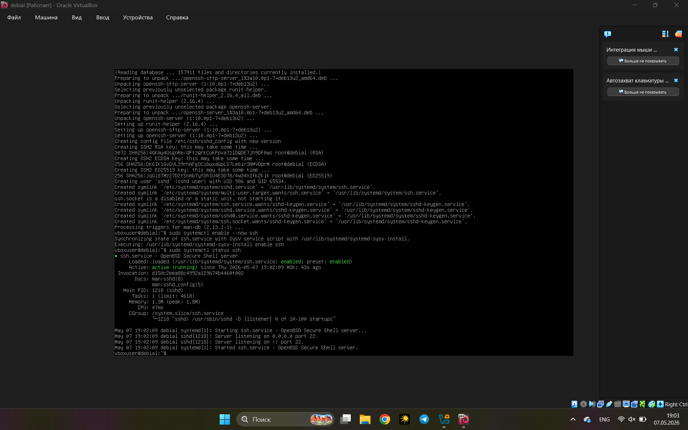
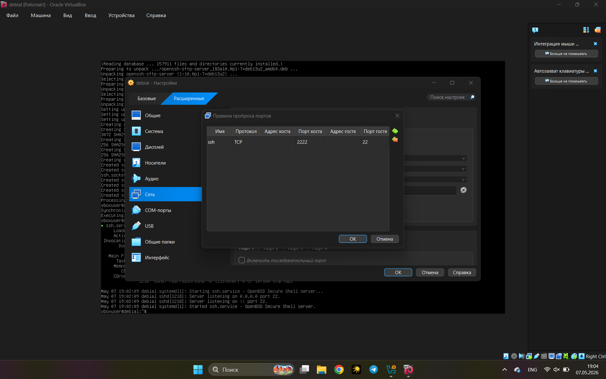
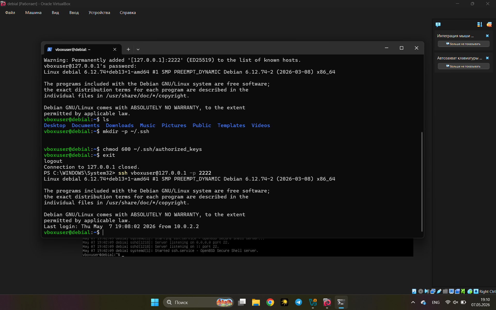

# Лабораторная работа №7. Развертывание на целевой машине.

## Состав группы

В группе работали: **Светличный Сергей** и **Кирилл Ефремов**.

Я готовил виртуальную машину для Кирилла и развёртывал свой проект на машине,
которую он подготовил для меня.

## Этапы выполнения работы

### Создание виртуальной машины

Согласно [работе №4](./lab4.md), мой дистрибутив - **Debian 13 (Trixie)**,
платформа виртуализации - **Oracle VM VirtualBox**. В качестве целевой ВМ
для этой работы использовалась та же машина, что и в лабе №4, но **с
отключённым графическим окружением GNOME**: для этой работы достаточно
консольного доступа, а отсутствие GUI сокращает потребление ресурсов и
поверхность атаки.

GNOME отключён через переключение системного `default target`:

```bash
sudo systemctl set-default multi-user.target
sudo reboot
```


Чтобы вернуть графику после сдачи работы, достаточно выполнить
`sudo systemctl set-default graphical.target && sudo reboot`.

**Потенциальные опасности предоставления доступа внешнему пользователю:**

- Доступ к личным файлам в домашней директории основного пользователя, если
  не разграничены права доступа.
- Использование вычислительных ресурсов (ЦП, ОЗУ, диск, сетевой канал)
  для посторонних задач, в том числе вредоносных.
- Перехват трафика с виртуальной машины и потенциальное использование её
  как точки входа в основную хостовую систему через уязвимости гипервизора.
- При неаккуратной настройке проброса портов - открытие SSH-сервера во внешнюю
  сеть и риск перебора паролей.

Эти опасности минимизируются изоляцией ВМ (NAT вместо моста по умолчанию),
запретом входа по паролю и созданием отдельного пользователя для Кирилла
без привилегий `sudo`.

### Настройка удаленного доступа

На хостовой системе (Windows) используется встроенный SSH-клиент `OpenSSH`.

В виртуальной машине установлен сервер OpenSSH:

```bash
sudo apt update
sudo apt install -y openssh-server
sudo systemctl enable --now ssh
sudo systemctl status ssh
```



**Порт TCP** - это 16-битный числовой идентификатор (от 0 до 65535),
который вместе с IP-адресом однозначно определяет конечную точку TCP-соединения.
Порт указывает операционной системе, какому именно процессу или службе
адресован сетевой пакет: например, порт 22 - стандартный для SSH, порт 80 -
для HTTP, порт 443 - для HTTPS.

**Проброс портов (port forwarding)** - это перенаправление сетевого трафика,
приходящего на определённый порт одного устройства, на другой адрес и порт.
В случае VirtualBox с сетью NAT это перенаправление с порта хостовой машины
на порт гостевой ВМ, что позволяет извне подключаться к службам внутри ВМ,
которая иначе скрыта за NAT и недоступна напрямую.

Проброс настроен в VirtualBox: `Настройки ВМ → Сеть → Адаптер 1 → Дополнительно →
Проброс портов`. Добавлено правило:

| Имя | Протокол | Хост IP   | Хост порт | Гость IP | Гость порт |
|-----|----------|-----------|-----------|----------|------------|
| SSH | TCP      |  | 2222      |          | 22         |




Проверка подключения по паролю:

```text
ssh vboxuser@127.0.0.1 -p 2222
vboxuser@127.0.0.1's password:
```
```
vboxuser@debial:~$
```

**Добавление публичного ключа для подключения без пароля.**

На хостовой машине сгенерирована пара ключей (если её ещё не было):

```powershell
ssh-keygen -t ed25519
```

Содержимое `~/.ssh/id_ed25519.pub` скопировано на ВМ:

```bash
mkdir -p ~/.ssh
chmod 700 ~/.ssh
nano ~/.ssh/authorized_keys
chmod 600 ~/.ssh/authorized_keys
```

Проверка входа без пароля прошла успешно:



**Отключение входа по паролю.** В файле `/etc/ssh/sshd_config` заменены
параметры:

```text
PasswordAuthentication no
PubkeyAuthentication yes
```

После этого служба перезапущена: `sudo systemctl restart ssh`.

Проверка: при попытке подключиться без ключа сервер сразу
отвечает `Permission denied (publickey)`, не запрашивая пароль.

### Настройка сессии для другого пользователя

Создан пользователь для Кирилла с домашней директорией:

```bash
sudo adduser kirishi
```

Кирилл передал свой публичный ключ (содержимое `id_ed25519.pub`).
Ключ добавлен в авторизованные:

```bash
sudo mkdir -p /home/kirishi/.ssh
sudo nano /home/kirishi/.ssh/authorized_keys
sudo chmod 700 /home/kirishi/.ssh
sudo chmod 600 /home/kirishi/.ssh/authorized_keys
sudo chown -R kirishi:kirishi /home/kirishi/.ssh
```

**Помещение в одну локальную сеть.** Оба компьютера были помещены в одну
общую локальную сеть. IP-адрес моего хостового компьютера в этой сети:

```text
IP хоста: 172.16.195.140
```

С компьютера Кирилла выполнен `ping 172.16.195.55` - пакеты доходят.


После окончания работы в пробросе портов VirtualBox
восстановлено значение `Хост IP = 127.0.0.1`. Оставлять открытый SSH-порт
доступным извне опасно: ботнеты постоянно сканируют диапазоны и подбирают
пароли (даже при выключенной парольной аутентификации это создаёт лишний шум
в логах и нагрузку).

Кирилл успешно подключился:

```cmd
PS C:\Windows\system32> ssh -A kirishi@172.16.195.55 -p 2222                                                            Linux debial 6.12.74+deb13+1-amd64 #1 SMP PREEMPT_DYNAMIC Debian 6.12.74-2 (2026-03-08) x86_64                                                                                                                                                  The programs included with the Debian GNU/Linux system are free software;                                               the exact distribution terms for each program are described in the                                                      individual files in /usr/share/doc/*/copyright.                                                                                                                                                                                                 Debian GNU/Linux comes with ABSOLUTELY NO WARRANTY, to the extent                                                       permitted by applicable law.                                                                                            Last login: Fri May  8 13:50:56 2026 from 172.16.195.140                                                                kirishi@debial:~$
```

### Развертывание программы

Эту часть я выполнял на машине, которую подготовил Кирилл.

**Список программ, необходимых для сборки и запуска проекта:**

- `git` - для клонирования приватного репозитория.
- `build-essential` - мета-пакет с GCC/G++, `make` и заголовками libc.
- `cmake` - система сборки, используемая в проекте.

Подключение к удалённой машине:

```bash
ssh sergay@172.16.195.140 -p 2222
The authenticity of host '[172.16.195.140]:2222 ([172.16.195.140]:2222)' can't be established.
ED25519 key fingerprint is SHA256:Z+EVcf2z7dLcyCfHqeChUpTDrO9BIKRw/rfmq6hinu0.
This key is not known by any other names.
Are you sure you want to continue connecting (yes/no/[fingerprint])? yes
Warning: Permanently added '[172.16.195.140]:2222' (ED25519) to the list of known hosts.
[sergay@kirill-virtualbox ~]$
```
Генерация пары ключей на ВМ Кирилла:
 
```text
[sergay@kirill-virtualbox ~]$ ssh-keygen -t ed25519
Generating public/private ed25519 key pair.
Enter file in which to save the key (/home/sergay/.ssh/id_ed25519):
Enter passphrase for "/home/sergay/.ssh/id_ed25519" (empty for no passphrase):
Enter same passphrase again:
Your identification has been saved in /home/sergay/.ssh/id_ed25519
Your public key has been saved in /home/sergay/.ssh/id_ed25519.pub
The key fingerprint is:
SHA256:OvpNDbmbk6lG7S2wdMZ+U2ufkKbWvesShwToYcipCtg sergay@kirill-virtualbox
```
 
Содержимое `id_ed25519.pub` добавлено в `Settings → Deploy keys` репозитория
на GitHub (без `Allow write access`):
 
```text
[sergay@kirill-virtualbox ~]$ cat ~/.ssh/id_ed25519.pub
ssh-ed25519 AAAAC3NzaC1lZDI1NTE5AAAAIHw2HQ9dZu+AZmYCXJRY7KgECMmrW9BwluDPgDZKlIa3 sergay@kirill-virtualbox
```
 
Клонирование репозитория и переключение на рабочую ветку:
 
```text
[sergay@kirill-virtualbox ~]$ git clone git@github.com:dryslo/tictactoe-course.git
Cloning into 'tictactoe-course'...
remote: Enumerating objects: 371, done.
remote: Counting objects: 100% (371/371), done.
remote: Compressing objects: 100% (147/147), done.
remote: Total 371 (delta 219), reused 364 (delta 216), pack-reused 0 (from 0)
Receiving objects: 100% (371/371), 127.20 KiB | 521.00 KiB/s, done.
Resolving deltas: 100% (219/219), done.
[sergay@kirill-virtualbox ~]$ cd tictactoe-course
[sergay@kirill-virtualbox tictactoe-course]$ git checkout heuristic
branch 'heuristic' set up to track 'origin/heuristic'.
Switched to a new branch 'heuristic'
```
 
Конфигурация и сборка проекта:
 
```text
[sergay@kirill-virtualbox tictactoe-course]$ mkdir -p build && cd build
[sergay@kirill-virtualbox build]$ cmake ..
-- The CXX compiler identification is GNU 15.2.1
-- Detecting CXX compiler ABI info
-- Detecting CXX compiler ABI info - done
-- Check for working CXX compiler: /usr/bin/c++ - skipped
-- Detecting CXX compile features
-- Detecting CXX compile features - done
-- Configuring done (0.7s)
-- Generating done (0.0s)
-- Build files have been written to: /home/sergay/tictactoe-course/build
[sergay@kirill-virtualbox build]$ make
[  8%] Building CXX object CMakeFiles/tttcore.dir/src/core/event.cpp.o
[ 16%] Building CXX object CMakeFiles/tttcore.dir/src/core/game.cpp.o
[ 25%] Building CXX object CMakeFiles/tttcore.dir/src/core/state.cpp.o
[ 33%] Building CXX object CMakeFiles/tttcore.dir/src/core/field.cpp.o
[ 41%] Linking CXX static library libtttcore.a
[ 41%] Built target tttcore
[ 50%] Building CXX object CMakeFiles/tttplayer.dir/src/player/my_player.cpp.o
[ 58%] Building CXX object CMakeFiles/tttplayer.dir/src/player/my_observer.cpp.o
[ 66%] Linking CXX static library libtttplayer.a
[ 66%] Built target tttplayer
[ 75%] Building CXX object tests/CMakeFiles/test_my_player.dir/test_my_player.cpp.o
[ 83%] Linking CXX executable test_my_player
[ 83%] Built target test_my_player
[ 91%] Building CXX object tests/CMakeFiles/test_stats.dir/test_stats.cpp.o
[100%] Linking CXX executable test_stats
[100%] Built target test_stats
```
 
Запуск тестов:
 
```text
[sergay@kirill-virtualbox build]$ make test
Running tests...
Test project /home/sergay/tictactoe-course/build
    Start 1: smoke_test_player
1/2 Test #1: smoke_test_player ................   Passed    1.15 sec
    Start 2: test_player_stats
2/2 Test #2: test_player_stats ................   Passed   12.97 sec
100% tests passed, 0 tests failed out of 2
```
 
Оба теста (`smoke_test_player` и `test_player_stats`) прошли успешно,
что подтверждает корректность сборки и работоспособность кода на целевой
машине.